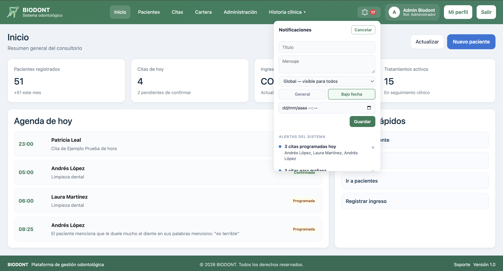
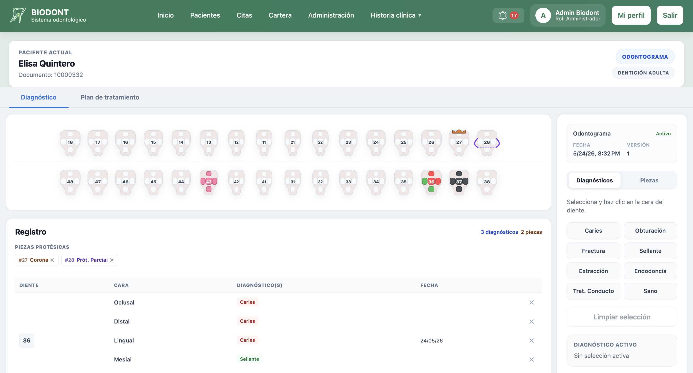
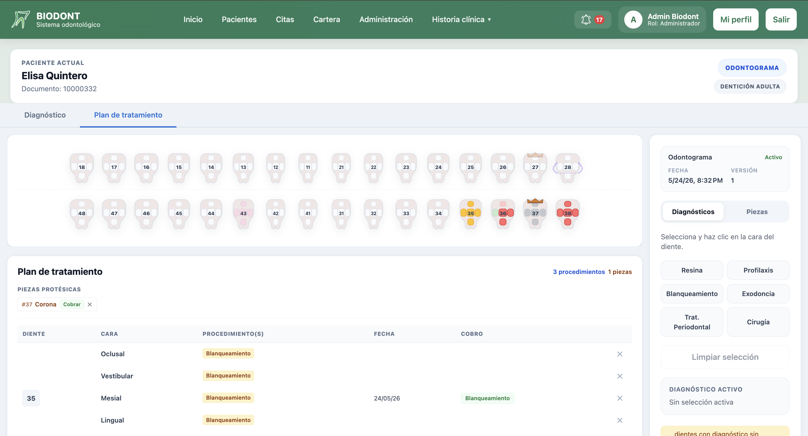
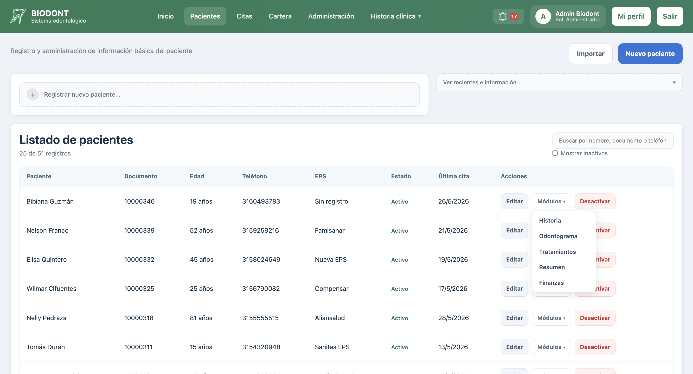
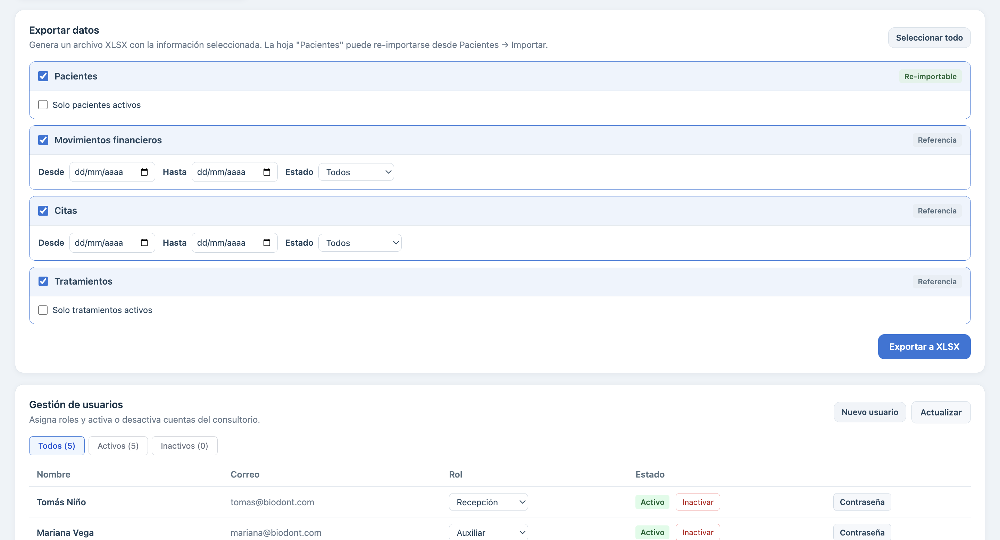
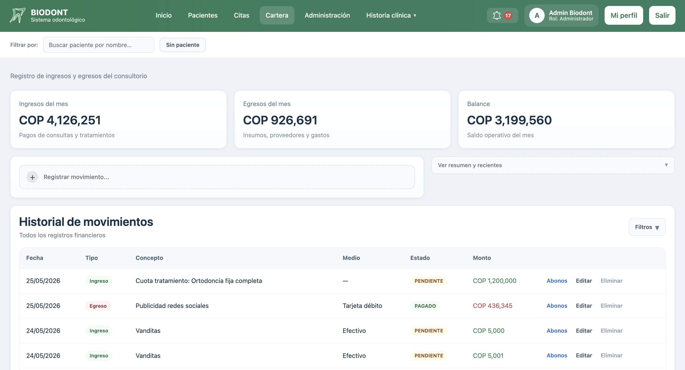
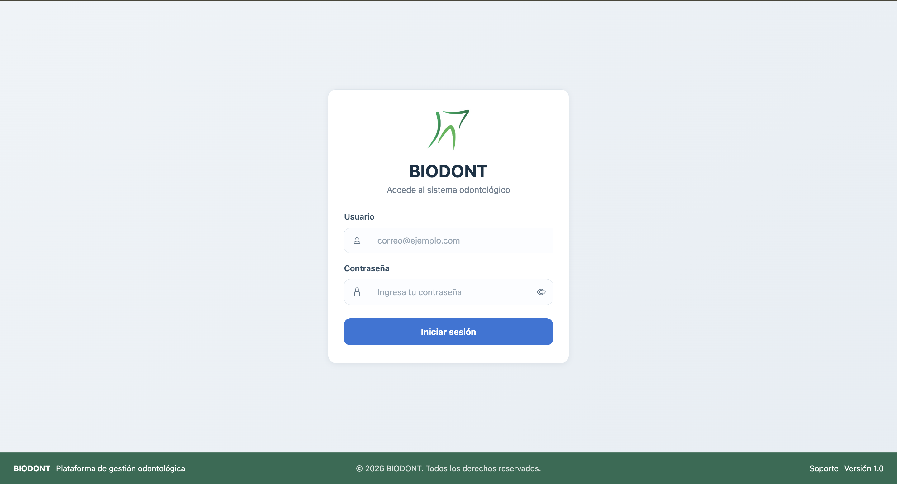

<p align="center">
  
</p>

# Biodont — Frontend


> Frontend del sistema odontológico Biodont. **Backend:** [Biodont](https://github.com/KolisCode/Biodont) · **API docs:** ver repo backend

Interfaz Angular para sistema de gestión odontológica. Incluye odontograma digital interactivo, historia clínica, agenda de citas y panel de administración.

---

## Capturas

<table>
  <tr>
    <td><br/><sub>Dashboard principal</sub></td>
    <td><br/><sub>Odontograma — diagnóstico</sub></td>
  </tr>
  <tr>
    <td><br/><sub>Odontograma — plan de tratamiento</sub></td>
    <td><br/><sub>Gestión de pacientes</sub></td>
  </tr>
  <tr>
    <td><br/><sub>Agenda y calendario</sub></td>
    <td><br/><sub>Panel de administración</sub></td>
  </tr>
  <tr>
    <td><br/><sub>Módulo de finanzas</sub></td>
    <td><br/><sub>Inicio de sesión</sub></td>
  </tr>
</table>

---

## Stack

- **Angular 21** — standalone components, RxJS
- **TypeScript 5**
- Comunicación con API en `http://localhost:3000`

## Instalación

```bash
npm install
npm start    # → http://localhost:4200
```

> Requiere el backend corriendo en `http://localhost:3000`. Ver [KolisCode/Biodont](https://github.com/KolisCode/Biodont).

## Build de producción

```bash
npm run build    # genera dist/ para servir desde el backend
```

## Verificación de tipos

```bash
node node_modules/typescript/bin/tsc --noEmit
```
